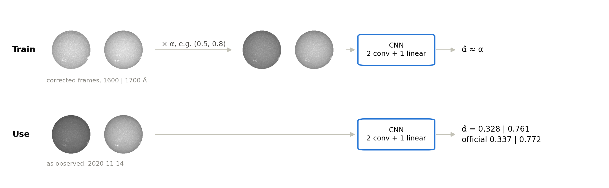
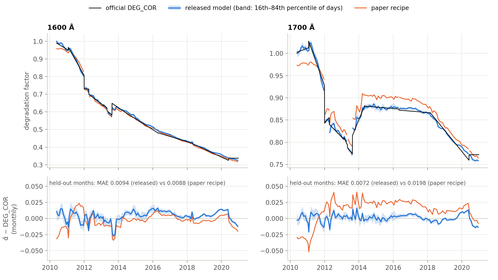
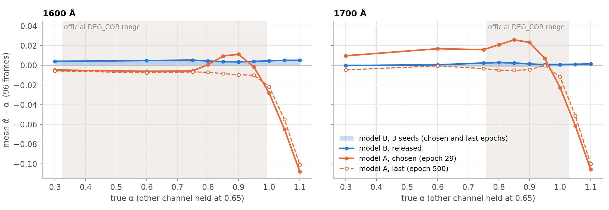

# Auto-calibration of SDO/AIA 1600 and 1700 Å with a CNN: final report

**In one sentence.** A small CNN, trained only on SDOML-v2 frames dimmed by random factors, reproduces the official AIA 1600/1700 Å degradation factor (`DEG_COR`) on held-out months of 2010–2020 with a mean absolute error of 0.0094 (1600 Å) and 0.0072 (1700 Å).

*Figure 1. Training dims a corrected frame pair by a random factor α and teaches the network to return it. In use, an as-observed pair goes in and α̂ comes out. Both rows show, for illustration, the held-out pair taken 2020-11-14, 23:54–23:59 UT; the numbers are the released model's.*

## Summary

- **Accuracy.** On the held-out months (November–December 2010–2020, 660 pairs), the released model's α̂ differs from `DEG_COR` by 0.0094 at 1600 Å and 0.0072 at 1700 Å (mean absolute error). Three training seeds span 0.0089–0.0095 and 0.0072–0.0078. Month by month, over all months, it stays within 0.027 (1600 Å) and 0.021 (1700 Å) of `DEG_COR` (Fig. 2).
- **Against simple baselines.** The better of two image-statistics baselines (the mode of the on-disk intensity) errs by 0.0130 and 0.0212. The CNN's error is 1.4× and 2.9× smaller.
- **Against the paper's recipe (model A).** At its chosen epoch, model A errs by 0.0088 at 1600 Å (slightly less than B) and 0.0198 at 1700 Å (2.7× more); at its last epoch, by 0.0129 and 0.0095. At 1700 Å it reads 0.029 low in 2010–2011 and 0.021–0.024 high in 2012–2018 (Fig. 2). Section 4 traces this mostly to an early checkpoint and partly to the paper's sigmoid output; the largest calibration bias inside the official range falls from 0.0335–0.0439 to 0.0053 (Fig. 3).
- **Caveat.** The stored SDOML-v2 frames were corrected with `DEG_COR`. Multiplying them back by `DEG_COR` therefore gives a known dimming of a real image. The comparison measures how well that dimming is recovered; it is not an independent check of the official curve.

## 1. Data

- **Source.** SDOML-v2 on AWS (registry.opendata.aws/sdoml-fdl), AIA 1600 and 1700 Å, 512² pixels. The frames are already divided by exposure time and by `DEG_COR`.
- **Selection.** One pair per day: the frames nearest 00:00 UT (within 15 min), `QUALITY` = 0, normal exposure. That gives 3,826 pairs, 2010-05-20 to 2020-12-31. The two frames of a pair are at most 12 min apart (median 6 min).
- **Split by month, as in the paper.** Training January–July (2,176 pairs); test August–October (990, used to choose checkpoints); held-out November–December (660).
- **Not packaged.** No image data are packaged from the local training and test dataset. The tutorial rebuilds them from AWS.

## 2. Method

| | Paper recipe (A) | Refined (B, released) |
| --- | --- | --- |
| Network | `Autocalibration6`: 2 convolutions + 1 linear layer, 261,698 parameters, input 2 × 256² | same |
| Output head | sigmoid | linear |
| Training α | 0.01–1.0 | 0.01–1.25 |
| Learning rate | 1e-3, constant | 1 warm-up epoch at 1e-4, then 1e-3, stepped down to 1e-5 |
| Epochs; time on the Mac (MPS) | 500; 96 min | 200; 37–39 min per seed |
| Checkpoint rule | first epoch at 100 % test success (epoch 29) | lowest test-month MSE (seeds 1, 2, 3: epochs 135, 159, 150) |
| Released | — | seed 1, epoch 135 (rule fixed before any held-out or `DEG_COR` evaluation of B; `tools/release.json`) |

- **Model A and the reference.** Model A uses the reference's network, head, α range and optimiser, but one frame a day for 2010–2020, 500 instead of 1000 epochs.
- **Shared settings.** Everything else follows the reference implementation (`autocal_paper_config.yaml`): 512² → 256² by `[::2]`, a fixed scale per channel, zero outside r = 200 px (100 px after subsampling), MSE loss, Adam, batch 64, and test and held-out frames mirrored.
- **Names.** "Chosen" is the checkpoint the notebooks save as `best`; for B, `final.pt` holds the same weights.
- **Evaluation.** As in notebook 03: synthetic dimming with fixed random α (0.01–1.0) on each split; recovery of `DEG_COR` on all frames; an α sweep from 0.3 to 1.1 on 96 frames (every 40th, all months). Every frame is mirrored left–right except those of the training split in the synthetic test.
  - Model B was evaluated on CPU.
- **Baselines.** Each estimates α from one number per frame and channel, relative to that number's median over the training months:
  - **plain:** the mean on-disk intensity;
  - **mode:** the mode of the log-intensity distribution, after the paper's baseline. Unlike the paper, it uses no HMI quiet-Sun mask, and it takes a smoothed-histogram mode instead of a log-normal fit.

## 3. Results

**Table 1.** Held-out months (660 pairs), except the calibration bias, which comes from the α sweep (96 frames, all months). "Synthetic" = frames dimmed by a known random α (0.01–1.0). Calibration bias = largest |mean α̂ − α| inside each channel's official range.

| | Synthetic: success at ±0.05 / MAE | `DEG_COR` MAE 1600 / 1700 Å | `DEG_COR` bias 1600 / 1700 Å | Calibration bias 1600 / 1700 Å |
| --- | --- | --- | --- | --- |
| Baseline, plain | 0.973 / 0.0160 | 0.0177 / 0.0251 | +0.0038 / −0.0005 | — |
| Baseline, mode | 0.986 / 0.0119 | 0.0130 / 0.0212 | −0.0015 / +0.0002 | — |
| A, chosen (epoch 29) | 1.000 / 0.0108 | 0.0088 / 0.0198 | −0.0024 / +0.0127 | 0.0233 / 0.0439 |
| A, last (epoch 500) | 0.995 / 0.0093 | 0.0129 / 0.0095 | −0.0064 / −0.0055 | 0.0196 / 0.0335 |
| **B, released** (seed 1, epoch 135) | 1.000 / 0.0070 | 0.0094 / 0.0072 | +0.0034 / +0.0008 | 0.0053 / 0.0028 |
| B, seed 1, last (epoch 200) | 0.999 / 0.0066 | 0.0089 / 0.0072 | −0.0007 / −0.0011 | 0.0017 / 0.0012 |
| B, 3 seeds, chosen epochs | 1.000 / 0.0070–0.0074 | 0.0089–0.0095 / 0.0072–0.0078 | +0.0009 to +0.0034 / +0.0005 to +0.0010 | 0.0038–0.0053 / 0.0016–0.0028 |
| B, 3 seeds, last epoch | 0.999–1.000 / 0.0066–0.0072 | 0.0089–0.0099 / 0.0072–0.0076 | −0.0016 to +0.0001 / −0.0011 to −0.0004 | 0.0008–0.0048 / 0.0005–0.0016 |

- **Success rate.** Success at ±0.05 is near 1 for every CNN and 0.973–0.986 for the baselines, so for these channels it no longer separates methods; the errors do.
- **Relative tolerances.** At relative tolerances of 10 % and more, both baselines score higher than every CNN checkpoint (at 10 %: 0.997–0.999 against at most 0.992), because their error scales with α.

*Figure 2. Top: the monthly median α̂ of the released model (blue; band: 16th–84th percentile of single days) and of the paper recipe (orange), against the daily `DEG_COR` (black). Bottom: the same as residuals α̂ − `DEG_COR`. Months are split where `DEG_COR` steps, so that a step is not drawn as a ramp. All 3,826 pairs, training months included; Table 1 uses the held-out months only. The released model's values are in `results/released_alpha_monthly.csv`.*

- **Scatter.** Single days scatter around `DEG_COR` by 0.010 (1600 Å) and 0.008 (1700 Å), as a standard deviation; within a month, by 0.005 and 0.004. The monthly medians of three seeds × two checkpoints agree within 0.005 and 0.004 (median range).
- **What remains after binning.** Part of it is shared by the two models: their monthly residuals correlate at 0.56 (1600 Å) and 0.33 (1700 Å). The released model's largest monthly deviations come right after steps in `DEG_COR`. After the +0.066 step on 2013-08-15, it reads up to 0.027 low at 1600 Å, and the paper recipe up to 0.034. Such features sit in the data or in `DEG_COR`, not in one model.

*Figure 3. Mean α̂ − α over 96 frames (every 40th, all months) dimmed by known α, the other channel held at 0.65. Blue: the released model (line) and model B's 3 seeds × 2 checkpoints (band). Orange: model A at its chosen (solid) and last (dashed) epoch. Grey: each channel's official range.*

## 4. Why the released model

Model A's 1700 Å bias has two causes. Most of it comes from the checkpoint: epoch 29, taken at a constant learning rate, keeps a transient offset and an overshoot just below α = 1. The rest comes from the sigmoid output, which reads low near and above α = 1 and cannot exceed 1. 1600 Å escapes both: model A's offset there is small (−0.006 to −0.005 at α 0.3–0.75), and its `DEG_COR` stays below 0.73 from 2012 on.

| Cause | Evidence at 1700 Å | Change in the released recipe | Result at 1700 Å |
| --- | --- | --- | --- |
| **The checkpoint.** Epoch 29, the first with 100 % test success, at a constant learning rate of 1e-3. | α sweep: +0.010 to +0.017 at α 0.3–0.75 and +0.026 at 0.85. Monthly residual +0.021 to +0.024 in 2012–2018. | One warm-up epoch, then a stepped learning rate (the released epoch 135 ran at 3e-4); checkpoint by lowest test-month MSE | α sweep within 0.002 at α 0.3–0.75; 2012–2018 residual +0.001 to +0.003 |
| **The sigmoid output.** Trained on α ≤ 1, it reads low near and above 1 and cannot exceed 1. | α sweep: −0.023 at α = 1.0, −0.061 at 1.05. Monthly residual −0.029 in 2010–2011, when `DEG_COR` was 0.93–1.03. | Linear head; training α up to 1.25 | α sweep within 0.003 up to α = 1.1; 2010–2011 residual +0.001 |

Monthly residual = median of the monthly α̂ − `DEG_COR` over the period.

- **The checkpoint is the larger cause.** Model A's own epoch 500 has lost the offset and the overshoot (−0.005 at α = 0.85), and its held-out MAE at 1700 Å is already 0.0095. On held-out months, the 61 pairs with `DEG_COR` > 1 (November–December 2010) carry 15 % of model A's error at 1700 Å.
- **The sigmoid part is structural.** Epoch 500 still reads −0.012 at α = 1.0 and −0.051 at 1.05: more training does not remove it. A linear head does. Apart from its biases, the network body scales with its input: dim the image by α and its features dim by α. A linear head keeps that; a sigmoid has to bend it, and reaches 1 only for an infinite input.
- **The paper reports it too.** It attributes the early-mission deviation of its 94 Å curve to having limited the degradation factor to less than one (its §5.2).
- **How it was found** The diagnostics showed that the offset sits in the weights and that the shape near α = 1 comes from the sigmoid; a post-hoc correction cannot exceed 1, and learning-rate decay removed only the offset (§1–§6.3). A from-scratch comparison with one seed then showed the paper's head (sigmoid, α ≤ 1) bending by −0.047 at α = 1, and a linear head trained to α = 1.25, with one warm-up epoch, staying within ±0.004 (§6.4). That recipe became 02b, run with three seeds.
- **Result.** At 1700 Å the held-out MAE falls from 0.0198 to 0.0072 and the monthly RMS residual from 0.022 to 0.006; the released model is closer to `DEG_COR` in 90 % of months. At 1600 Å nothing changes: held-out MAE 0.0094 against 0.0088, monthly RMS 0.009 against 0.011, closer in 48 % of months.
- **Which checkpoint.** The release follows the rule fixed before any held-out evaluation: 02b's own choice, epoch 135, at a learning rate of 3e-4. It keeps an offset of +0.0035 to +0.0053 at 1600 Å (Fig. 3). The last epoch (200, learning rate 1e-5) cuts it to ≤ 0.0017 with similar errors (Table 1), so a future release could use it.

## 5. Limitations

- **Coverage.** The model has not been tested after 2020, where SDOML-v2 ends.
- **Not a blind test.** Recipe B was chosen after diagnostic runs that looked at held-out months, `DEG_COR` and the calibration curve, so none of its numbers is fully blind. Only the checkpoint and release rule were fixed before B was evaluated.
- **Single-frame scatter.** At α = 0.9 the frame-to-frame standard deviation is 0.015 (1600 Å) and 0.009 (1700 Å), and it grows with α. At 1600 Å part of it follows the brightness of the corrected frame (r = 0.43 with its intensity mode on held-out months; −0.01 at 1700 Å). That brightness mixes solar variability with any `DEG_COR` error, and this test cannot separate the two; their standard error would be about 0.001 if days were independent, so that is a lower bound.

## 6. Problems found and fixed

- **The paper recipe's 1700 Å bias.** Two causes: a transient output offset frozen by the checkpoint rule, and the sigmoid head's bend near α = 1. This led to recipe B.

## 8. Files

| Path | What |
| --- | --- |
| `FINAL_REPORT.md`, `figures/` | this report |
| `report.pdf` | four-page summary: goal, network, curves, why the released model |
| `04_tutorial_autocal_uv.ipynb` | how to use the model (executed; local-data path) |
| `sdoml_uv_dataset.py` | dataset and model code (copy of `../run/sdoml_uv_dataset.py`) |
| `models/` | released weights and model card |
| `results/` | evaluations of model B, baselines, the check of `eval03_vm.py` against 03, `report_numbers.json` |
| `results/released_alpha_daily.csv`, `results/released_alpha_monthly.csv` | the released model's α̂ for every pair, and by month with its scatter, seed spread and residuals (header lines explain the columns) |
| `tools/` | scripts that made `results/`, the curve files, the figures, the slide and this report; `release.json` (the release rule); `check_numbers.py` (re-derives the numbers) |

To regenerate (needs my original`../run/` with its data, notebooks and results, which are not included here):

1. From `../run/`: `python ../final_report/tools/eval03_vm.py autocal_uv_1600_1700_refined ../final_report/results/eval_autocal_uv_1600_1700_refined`, repeated until it prints `DONE` (likewise `_s2`, `_s3`); then `python ../final_report/tools/baselines.py ../final_report/results/baselines`.
2. From `final_report/`: `python tools/make_curve.py && python tools/make_report_numbers.py && python tools/make_figures.py && python tools/make_slide.py && python tools/make_report.py && python tools/check_numbers.py`.

## References

- Dos Santos, L. F. G. et al. 2021, A&A 648, A53, arXiv:2012.14023 (method; [article](https://www.aanda.org/articles/aa/full_html/2021/04/aa40051-20/aa40051-20.html)).
- Galvez, R. et al. 2019, ApJS 242, 7 (SDOML).
- SDOML-v2: [AWS Registry of Open Data](https://registry.opendata.aws/sdoml-fdl/) ("There are no restrictions on the use of this data") and [github.com/SDOML/SDOMLv2](https://github.com/SDOML/SDOMLv2).
- `sdo-autocal_pub` reference code: DOI [10.5281/zenodo.4434743](https://doi.org/10.5281/zenodo.4434743).
