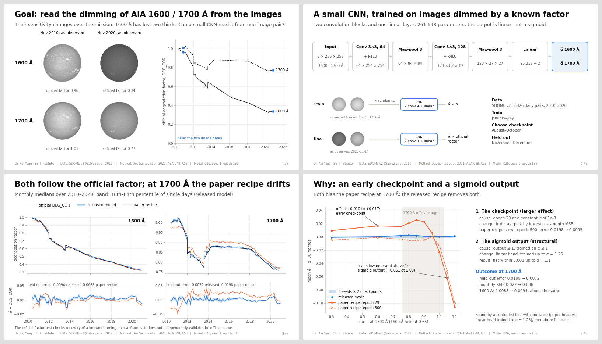

# AIA 1600/1700 Å auto-calibration — final package

A small CNN that estimates the degradation of SDO/AIA's 1600 Å and 1700 Å channels from the images themselves. Model A follows the method of Dos Santos et al. (2021) on SDOML-v2; model B, released here, refines its training recipe.

## Start here

| | |
| --- | --- |
| `report.pdf` | four-page summary: goal, network, curves, why the released model |
| `FINAL_REPORT.md` | the report: data, method, results, limitations |
| `04_tutorial_autocal_uv.ipynb` | how to use the model, step by step |
| `models/` | the released model and its card |
| `results/released_alpha_monthly.csv` | the released model's α̂ by month, 2010–2020, with uncertainties (daily values: `results/released_alpha_daily.csv`) |

## Key numbers

- **Error vs the official factor (`DEG_COR`).** Mean absolute error 0.0094 at 1600 Å and 0.0072 at 1700 Å on the held-out months (November–December 2010–2020).
- **Against the better of two image-statistics baselines.** 1.4× and 2.9× smaller error.
- **Calibration.** The largest bias inside the official range is 0.0053 (α sweep, 96 frames); model A's is 0.0335–0.0439.
- **Month by month** (all months). The released model stays within 0.027 (1600 Å) and 0.021 (1700 Å) of `DEG_COR`; the paper recipe reaches 0.034 and 0.052 (report Fig. 2).

## Requirements

- **Packages.** Python ≥ 3.10, torch, numpy, pandas, matplotlib.
- **Data.** The tutorial reads 11 frame pairs, plus one per month with the local data, from `../run/data` when it exists, and otherwise the 11 from SDOML-v2 on AWS (needs `s3fs` and `numcodecs`). It plots the shipped curve either way. No image data are included.

## Notes

- **Where the tutorial was run.** It was executed here on CPU with the local data. Its AWS reader was tested only against a local Zarr store of the same layout; it has not been run against AWS from this machine.
- **How the evaluation was run.** Model B was evaluated on CPU with `tools/eval03_vm.py`, a port of notebook 03 that reproduces 03's model-A outputs to within 1.3e-06.
- **Regenerating.** See the report's §8.
- **Sources.** The training and evaluation notebooks, and the data, stay in `../run/`.
